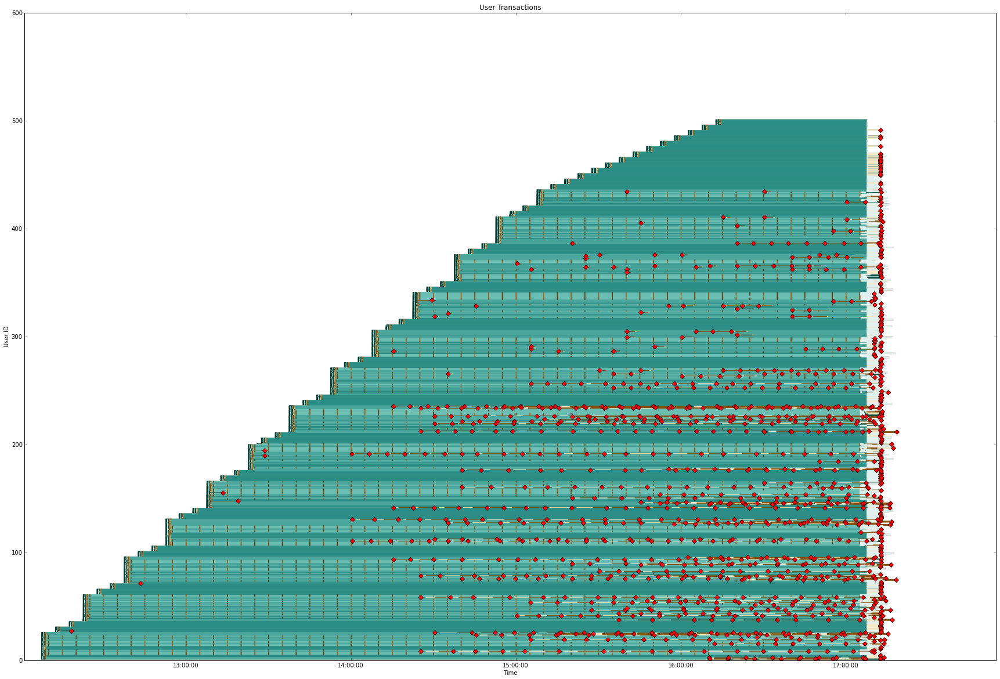

:title: Breaking Things For Money
:data-transition-duration: 500
:css: hovercraft.css

About Me
========

Tony Simpson
------------
Lead Technical Consultant @ The Test People

@agjasimpson

github.com/tonysimpson

#breakingpycon

----

About The Test People
=====================

* Testing consultancy based in Yorkshire (offices Leeds, Londonhovercarft imclude , Gibraltar).

* Company prides itself on its innovation and technical delivery.

* #44 on the 'Sunday Times Tech Track 100 2013', *#1 in Yorkshire*.

@thetestpeople

----

What We Do
==========

* Performance Testing.

* Managed Functional Testing Teams.

* Test Automation.

* Agile and CI/CD consultancy.

----

Something about existing tools??
================================

----

Pynamite
========

*If your application is not broken you're not using enough Pynamite!*

----

Ideas Borrowed From
-------------------

* Flask (extension mechanism)

* Erlang OTP (process management, messaging, let it crash and restart it, isolated processes)

* Python Web Frameworks (project scaffolding and packaging, dev server/runner)

----

What Does It Alow Us To Do
--------------------------

* Video Streaming
* Warehouse Management Systems
* Legacy Applications
* Flash and Silverlight
* Data Warehouse Infrastructure
* Network Attached Devices
* Uncommon and Bespoke Protocols

----

----

----

Key Libraries And Technology
----------------------------

* ZeroMQ
* Boto
* IPython Notebook
* Matplotlib
* Docopt
* Paramiko

----

Geist
=====

----

*END*

