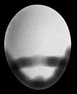
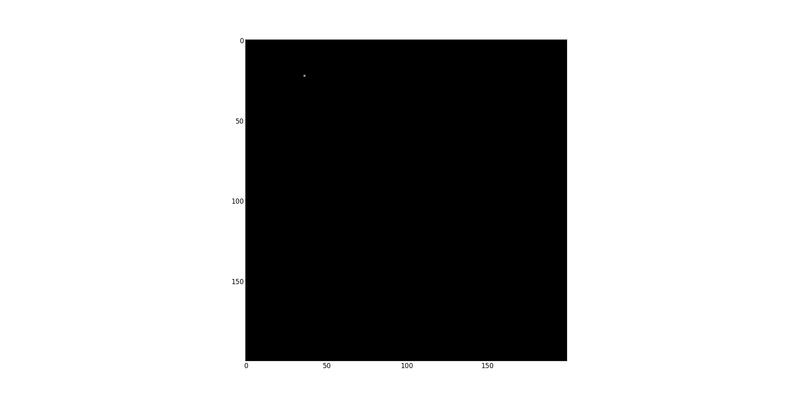
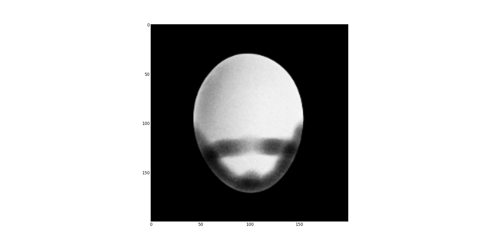
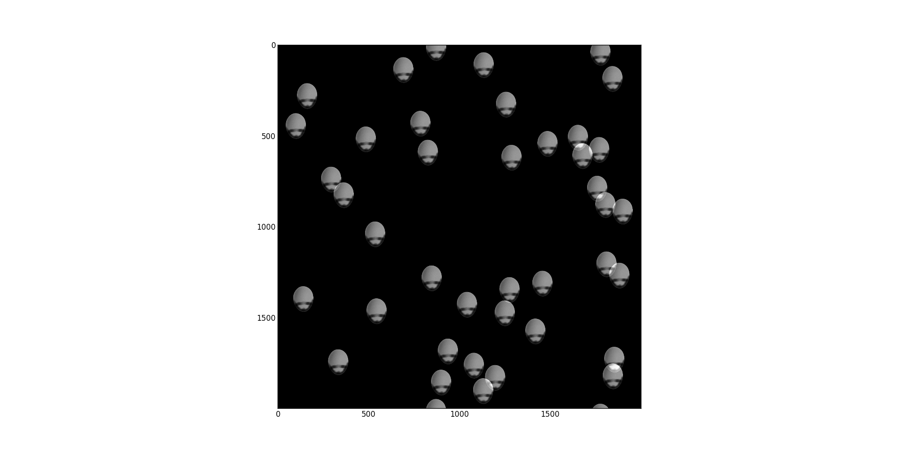
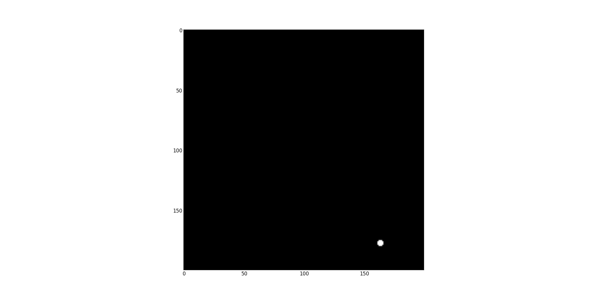
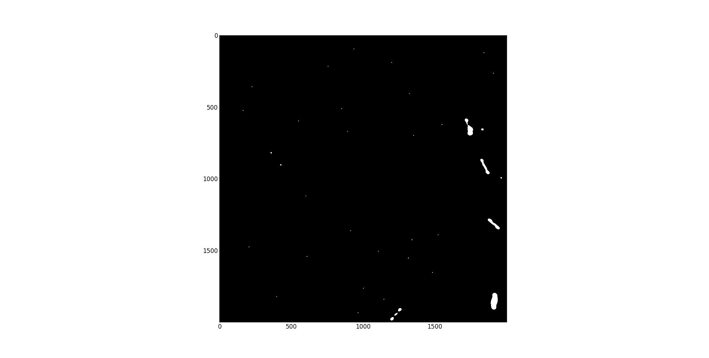

:title: Breaking Things For Money
:data-transition-duration: 500
:css: thetestpeople.css

About Me
========

Tony Simpson
------------
Lead Technical Consultant @ The Test People

@agjasimpson

github.com/tonysimpson

#breakingpycon

----

About The Test People
=====================

* Testing consultancy based in Yorkshire (offices Leeds, Londonhovercarft imclude , Gibraltar).

* Company prides itself on its innovation and technical delivery.

* #44 on the 'Sunday Times Tech Track 100 2013', **#1 in Yorkshire**.

@thetestpeople

----

What We Do
==========

* Performance Testing.

* Managed Functional Testing Teams.

* Test Automation.

* Agile and CI/CD consultancy.

----

Pynamite
========

*If your application is not broken you're not using enough Pynamite!*

----

Ideas Borrowed From
-------------------

* Flask (extension mechanism)

* Erlang OTP (process management, messaging, let it crash and restart it, isolated processes)

* Python Web Frameworks (project scaffolding and packaging, dev server/runner)

----

What Does It Alow Us To Do
--------------------------

* Video Streaming
* Warehouse Management Systems
* Legacy Applications
* Flash and Silverlight
* Data Warehouse Infrastructure
* Network Attached Devices
* Uncommon and Bespoke Protocols

----

.. image:: static/transactions.png
    :height: 600px
    :width: 900px

----

.. image:: static/transactions_big.png
    :height: 600px
    :width: 900px

----

Key Libraries And Technology
----------------------------

* ZeroMQ
* Boto
* IPython Notebook
* Matplotlib
* Docopt
* Paramiko

----

Geist
=====

----

Playing With FFTs
-----------------

----

Picture Of Peter From My Computer
---------------------------------

.. image:: static/peter.jpg
    :height: 600px

----

Take Peter
----------

----

And Correlate Him With A Point
------------------------------

----

Single Peter
------------

----

.. code:: python

    import numpy
    from numpy.fft import rfft2, irfft2
    from PIL import Image

    peter_grey = numpy.array(Image.open('static/peter.png')).astype(numpy.float64) / 255

    width, height = 200, 200
    single_pixel = numpy.zeros((height, width), numpy.float64)
    single_pixel[22, 36] = 1

    single_peter = irfft2(rfft2(single_pixel) * rfft2(peter_grey, single_pixel.shape))

----

A Lot Of Points Equals A Lot Of Peters
--------------------------------------

----

.. code:: python

    width, height = 2000, 2000
    lots_of_pixels = numpy.zeros((height, width), numpy.float64)
    lots_of_pixels[zip(*[(random.randint(0, width-1),
                   random.randint(0, width-1)) for i in range(40)])] = 1
    lots_of_peter = irfft2(rfft2(lots_of_pixels) * rfft2(peter_grey,
                                                         lots_of_pixels.shape))

----

Convolution
-----------

.. code:: python

    single_conv = irfft2(rfft2(single_peter) * rfft2(peter_grey[::-1, ::-1],
                                                     single_peter.shape))
    found_single_peter = single_conv > (single_conv.max() * 0.98)

----

.. code:: python

    lots_conv = irfft2(rfft2(lots_of_peter) * rfft2(peter_grey[::-1, ::-1],
                                                    lots_of_peter.shape))
    found_lots_of_peter = lots_conv > (single_conv.max() * 0.98)

----

----

----

To get round the problems of FFT based convolution you need to investigate edge
detection and image thresholding - but that's a much longer talk.

----

Sikuli and Xpresser use OpenCV `matchTemplate` with CV_TM_CCOEFF_NORMED

Convolution on Wikipedia [http://en.wikipedia.org/wiki/Convolution]

----

Gawker - Simple Screen OCR (Outdated)
-------------------------------------

.. raw:: html

    <video controls>
      <source src="static/capturepricefeed1.mp4" type="video/mp4">
    Your browser does not support the video tag.
    </video>

----

Numpy - Ancient Technology
--------------------------

* Once you've learnt the symbols it is imensly powerful

----

A Python In Every Proces
========================

----

.. code:: python

    DIGIT_MAP = {i:j for i,j in zip('0123456789','6514798023')}

    SET_WINDOW_TEXT_A = """
    BOOL WINAPI SetWindowTextA(
      _In_      HWND hWnd,
      _In_opt_  LPCSTR lpString
    );
    """

    @hook(ctypes.windll.user32, SET_WINDOW_TEXT_A)
    def SetWindowTextA(hWnd, lpString):
        text = ''.join([c if not c.isdigit() else DIGIT_MAP[c] for c in lpString])
        print("Got %r using %r" % (lpString,text))
        return SetWindowTextA.unhooked(hWnd, text)

----

Calculator Demo
---------------

.. raw:: html

    <video controls>
        <source src="static/wrongulator.webm" type="video/webm">
        Your browser does not support the video tag.
    </video>

----

*END*
